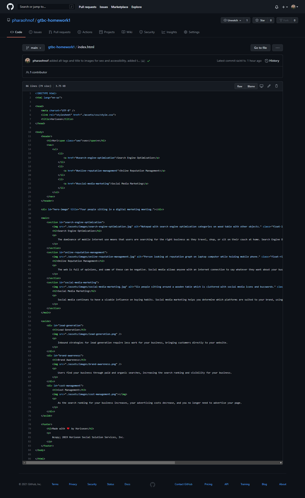
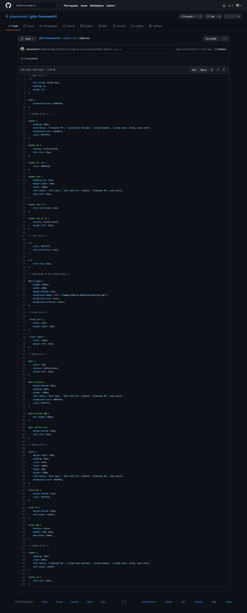

# Horiseon Website
Georgia Tech Full Stack Bootcamp - Homework 1

This project was a homework assignment for the Georgia Tech Full Stack Bootcamp and involved refactoring a webpage. (see full description below)


## Installation

Link to working site: 
 <https://pharaohnof.github.io/gtbc-homework1>

Clone the repository: 
 git clone https://github.com/pharaohnof/gtbc-homework1.git


## Description

 In this project I was given code to refactor to the following:

#### User Story

```
AS A marketing agency
I WANT a codebase that follows accessibility standards
SO THAT our own site is optimized for search engines
```

#### Acceptance Criteria

```
GIVEN a webpage meets accessibility standards
WHEN I view the source code
THEN I find semantic HTML elements
WHEN I view the structure of the HTML elements
THEN I find that the elements follow a logical structure independent of styling and positioning
WHEN I view the image elements
THEN I find accessible alt attributes
WHEN I view the heading attributes
THEN they fall in sequential order
WHEN I view the title element
THEN I find a concise, descriptive title
```

### Mock-Up

**Note**: This layout is designed for "desktop", so you may notice that some of the elements don't look like the Mock-Up when viewed at a resolution smaller than 768px. In future lessons, you will learn how to make elements "responsive" so that your web application is optimized for any screen size.

The following image shows the web application's appearance and functionality:


## Result

Using semantic code and simplification, I refactored the given code to meet all of the acceptance criteria without changing the appearance or functionality of the webpage.

The following screenshots show resulting Webpage, HTML and CSS code:




